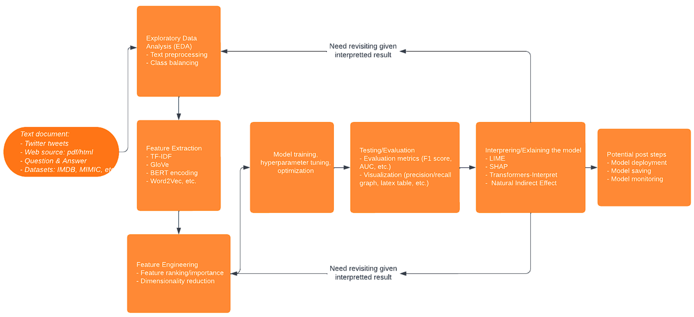

# NLP Interpretability Pipelines

## Description
Machine learning pipelines are frameworks that automate many aspects of model development tasks and ML research. We wanted to design a standardized pipeline infrastructure that works with different data storage and access patterns, a variety of models, and different evaluation and Interpretability methods.

## Components

1. Data Storage and Data Access
2. Data Preprocess
3. Feature Extraction
4. Model Training and Evaluation
5. Interpretability Options
6. Model Deployment

Following is a flow chart that demonstrates the different pipeline stages in out ML pipeline.

## UML

The structure of the pipeline exercise the dependency inversion principle and the current design for its architecture is shown in the following diagram.

## Python Coding Style

To commit to this repository, please make sure that your code conforms with the Google Python coding style. For more details, please read https://google.github.io/styleguide/pyguide.html.